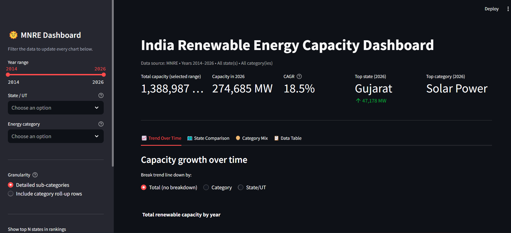

# 🌞 India Renewable Energy Capacity Dashboard

An interactive **Streamlit** dashboard that visualizes India's state-wise renewable energy capacity (2014–2026), built on data from the **Ministry of New and Renewable Energy (MNRE)**.

Explore capacity trends over time, compare states head-to-head, break down the energy category mix, and export filtered data — all through a single-page, filter-driven interface.


---

## 📸 Preview



---

## ✨ Features

- **📈 Trend over time** — total capacity growth, broken down by category or by state, plus year-on-year change
- **🗺️ State comparison** — top-N state rankings and a head-to-head comparison of any two states (trend + category mix)
- **🥧 Category mix** — share of capacity by category, how that share has evolved over time, and top sub-categories
- **📋 Data table** — the exact filtered dataset, exportable as CSV with one click
- **🎛️ Sidebar filters** — year range, state/UT, energy category, granularity toggle (detailed vs. roll-up rows), and top-N control
- **📊 KPI summary** — total capacity, latest-year capacity, CAGR, top state, and top category, computed live from your filters

## 🧮 KPI Definitions

| Metric | Definition |
|---|---|
| **Total capacity** | Sum of `Capacity (MW)` across the selected year range and filters |
| **CAGR** | Compound annual growth rate from the earliest to the latest selected year |
| **Top state / category** | Highest-capacity state/category in the latest selected year |

## 🗂️ Data

The dashboard reads from `data.xlsx`, sheet `Consolidated Data`, with these columns:

| Column | Description |
|---|---|
| `Year` | Reporting year |
| `State/UT` | Indian state or union territory |
| `Category` | Energy category (e.g., Solar, Wind, Bio-Power) |
| `Sub-Category` | Finer-grained source type |
| `Capacity (MW)` | Installed capacity in megawatts |

Some rows are pre-aggregated roll-ups (e.g., a state's `Total` row, or `*-Power Total` sub-category rows). By default the app excludes these to avoid double-counting; a sidebar toggle lets you include them if you specifically want official roll-up totals.

**To refresh with newer data:** replace `data.xlsx` with an updated export that keeps the same sheet name and columns — no code changes required. Since the data is cached, restart the app (or clear the Streamlit cache) after swapping the file.

## 🚀 Getting Started

### Prerequisites
- Python 3.9+
- pip

### Installation

```bash
git clone https://github.com/<your-username>/mnre-renewable-energy-dashboard.git
cd mnre-renewable-energy-dashboard
pip install -r requirements.txt
```

### Run locally

```bash
streamlit run app.py
```

The app opens automatically at [http://localhost:8501](http://localhost:8501).

## 🏗️ Project Structure

```
├── app.py              # Streamlit dashboard (data loading, filters, charts)
├── data.xlsx           # Consolidated MNRE capacity data
├── requirements.txt    # Python dependencies
└── README.md
```

## 🛠️ Tech Stack

- **[Streamlit](https://streamlit.io/)** — app framework and UI
- **[Pandas](https://pandas.pydata.org/)** — data loading, cleaning, and aggregation
- **[Plotly Express](https://plotly.com/python/plotly-express/)** — interactive charts (area, line, bar, pie)

## 🗺️ Roadmap

- [ ] Deploy to Streamlit Community Cloud and link a live demo
- [ ] Add per-capita / per-state-area normalized views
- [ ] Add a national choropleth map view
- [ ] Automate data refresh from the official MNRE source

## 🤝 Contributing

Issues and pull requests are welcome. If you spot a data inconsistency or have an idea for a new view, feel free to open an issue.

## 📄 License

This project does not yet specify a license. If you'd like to reuse this code, please open an issue to ask, or check back — an [MIT License](https://choosealicense.com/licenses/mit/) is planned.

## 🙏 Acknowledgements

Data sourced from the **Ministry of New and Renewable Energy (MNRE)**, Government of India.

---

Built by [Awasarkar](https://github.com/<your-username>) • [LinkedIn](https://linkedin.com/in/<your-linkedin>)
